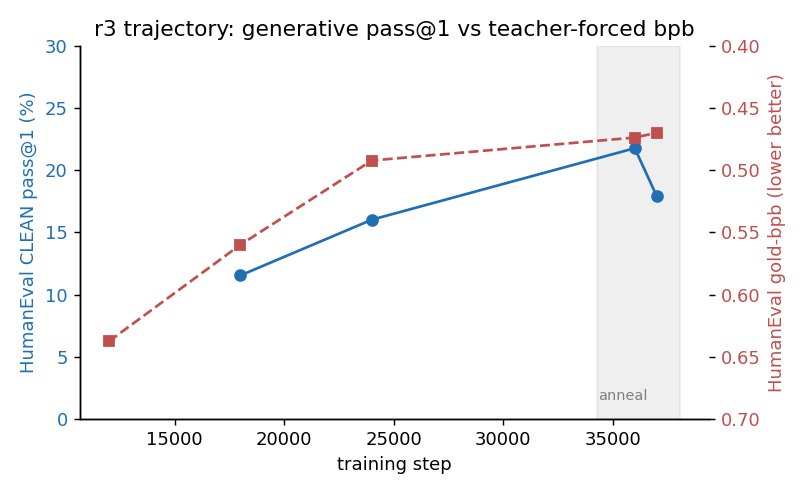
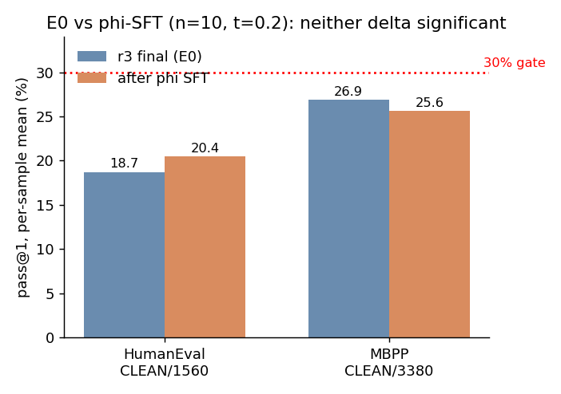
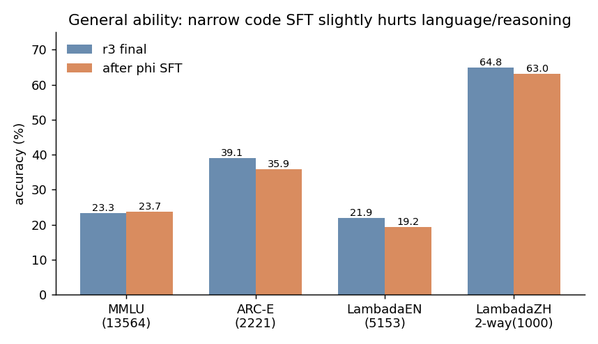
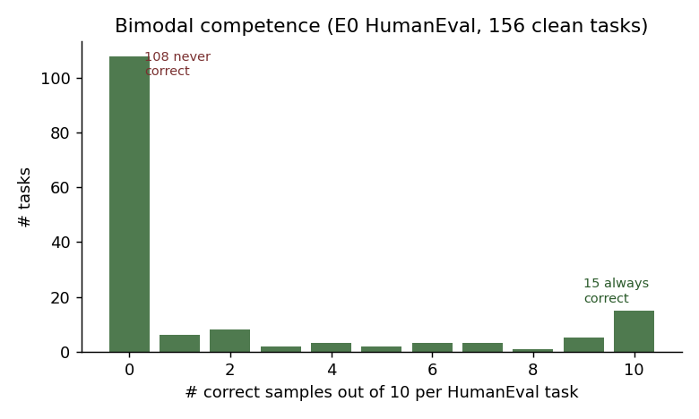

# V4.1 Round-1 Technical Report
### A 3.21B-total / 343M-active CSA2 + SWA MoE trained on 30B tokens: code, knowledge, language, and the narrow-SFT null result

**Date:** 2026-09-15
**Run:** `v41_r3_0914` (pretrain) → `ckpt_v42_phisft_n6_20260915T063647Z.pt` (phi SFT)
**Hardware:** 8× H20 (SM90), fp8, world-8 DDP
**Status:** round closed. Gate not reached; root cause localized to training-data scale and coverage, not architecture.

---

## Abstract

We trained a 12-layer MoE language model (3.21B total, ~343M active parameters per token)
on 29.94B tokens under the V4.1 architecture — Compressed Sparse Attention 2 (8:1 KV
pooling + learned entry selection) plus a 128-token sliding-window branch, 48-expert
top-3+1-shared MoE, partial RoPE-64, fp8. On a strict, decontaminated, n=10
temperature-0.2 protocol the final pretrained checkpoint scores **HumanEval CLEAN 18.72%**
and **MBPP CLEAN 26.89%**; general ability is weak (MMLU 23.3%, LAMBADA-EN 21.9%,
Chinese open-acc ~0). A 63.7M-token, 6-epoch code-exercise SFT produced **no
statistically significant code gain** (paired bootstrap CI crosses zero) while
**significantly degrading language ability** (LAMBADA-EN −2.7). The competence
distribution is bimodal: 108/156 HumanEval tasks are never solved in 10 samples while
15 are always solved, i.e. the bottleneck is coverage, not sampling or stability.
Comparably sized open models (1.5–3B) trained on 1–5T tokens score 40–75% on HumanEval;
the ~35–160× training-data gap, rather than the CSA2/MoE design, accounts for most of
the difference. The report closes with the evidence against RL here (headroom below the
0.15 gate) and the data-scaled next step.

---

## 1. Model and training configuration

| Item | Value |
|---|---|
| Layers / d / heads | 12 / 1024 / 8 |
| Attention | CSA2 Full/Reuse + 2 PureSWA-only layers; SWA window 128; KV entries pool 8 tokens → 1 |
| Position | partial RoPE, 64 dims |
| MoE | 48 experts, top-3 + 1 shared; expert FFN 1728 |
| Parameters | 3,209,392,704 total; ~343M active |
| Precision | fp8 (weights + activations), grad checkpointing |
| Tokens trained (r3) | **29.94B** (38,070 steps; world8 × B4 × accum6 ≈ 786,432 tok/step) |
| Schedule | main phase then anneal (steps 34,264–38,070), cosine warmdown |
| Final loss / val | train 1.582 / val 1.609 |
| Wall time | 147,194 s ≈ 40.9 h; measured ~204k tok/s over 8 H20 |
| Final checkpoint | `ckpt_v41_r3_0914.pt`, 12.91 GB, sha `f76ddeb9…2ba49b2f` |

SFT stage: `sft_phi_codeexercises_v42_65m_0914.pt` — 23,637 packed rows,
**63.97M supervised tokens**, LR 0.1× pretrain, fresh optimizer, **6 epochs = 4,428
steps**, ~2.3 h. The pack is proven disjoint from r3 pretraining (r3 consumed the
`.excl56d` cache; 273,879 excluded docs) and externally decontaminated against
HumanEval (0 hits) and MBPP (only 3 tasks, all inside the 89-task r3 union), so SFT
gains cannot be memorised test answers.

## 2. Evaluation protocol

- **Code (metric of record).** n = 10 samples per task at temperature 0.2, per-task
  unbiased estimate p_i = c_i / 10; score = mean p_i over tasks. HumanEval uses the
  rstrip-NL column; MBPP the signature+docstring rstrip scorer. Paired across
  checkpoints by fixed `(task_id, sample_idx)` seed; uncertainty by 10,000 task-level
  bootstrap resamples, one-sided 95%.
- **Decontamination.** CLEAN denominators exclude the r3 contamination unions:
  HumanEval 164 → **156** (8 tasks), MBPP 427 → **338** (89 tasks). Both unions are
  recomputed from manifests, not carried from other rounds.
- **General ability.** MMLU (screened n=13,564), ARC-Easy (n=2,221), LAMBADA-EN
  (n=5,153), LAMBADA-ZH (n=1,000), same screened subset and order for both checkpoints.
- The coverage number "≥1 of 10 correct" (≈pass@10) is reported separately and is
  **not** the gate.

## 3. Results

### 3.1 Code at the final checkpoint (E0)

| Benchmark | FULL | **CLEAN (gate)** | empty |
|---|---|---|---|
| HumanEval | 293/1640 = 17.87% | **292/1560 = 18.72%** | 0 |
| MBPP (sig-rstrip) | 1120/4270 = 26.23% | **909/3380 = 26.89%** | 45 |

Coverage (≥1/10): HumanEval 30.77%, MBPP 40.24%.

### 3.2 Training trajectory

Greedy rstrip HumanEval CLEAN improved through the main phase and plateaued at anneal;
the single-greedy 36k→37k swing (21.79%→17.95%) is sampling noise, confirmed by the
flat teacher-forced gold-bpb and by the n=10 E0 result.

| step | 18k | 24k | 36k | 37k | E0 (n=10) |
|---|---|---|---|---|---|
| HE CLEAN greedy % | 11.54 | 16.03 | 21.79 | 17.95 | **18.72** |
| gold-bpb (per-task, ↓) | 0.5599 | 0.4920 | 0.4735 | 0.4697 | — |

Anneal validation moved only −0.005 (1.682@34.5k → 1.677@37.5k): the final cosine
anneal extracted essentially no measured likelihood gain, and pass@1 did not rise.

### 3.3 Narrow phi-SFT is statistically null on code

| CLEAN | E0 | after SFT | Δ | one-sided 95% lower | P(E0<SFT) | verdict |
|---|---|---|---|---|---|---|
| HumanEval | 18.72 | 20.45 | +1.73 | −1.41 | 0.82 | not significant |
| MBPP | 26.89 | 25.62 | −1.27 | −3.28 | 0.15 | not significant |

A case-level read shows the mechanism: HumanEval/1 (parenthesis grouping) went c=0 →
c=8/10 (the counter pattern was learned), but HumanEval/49 (`modp`, previously the
correct one-line `pow(2,n,p)`) and /61 (bracket matching) collapsed to c=0 and began
emitting pack-template boilerplate. Six epochs on a narrow distribution teach one
primitive while damaging previously held ones.

### 3.4 SFT taxes general ability

| Dimension (n) | r3 | after SFT | Δ |
|---|---|---|---|
| MMLU (13,564) | 23.34 | 23.70 | +0.35 (noise) |
| ARC-E (2,221) | 39.08 | 35.88 | **−3.20** |
| LAMBADA-EN (5,153) | 21.93 | 19.23 | **−2.70 (≈5σ)** |
| LAMBADA-ZH open-acc@1 (1,000) | 0.0 | 0.0 | 0 (floor; 2-way 64.8→63.1) |
| math likelihood (3,134) | 97.99 | 97.42 | −0.57 (near ceiling) |

The narrow code pack trades measurable language/reasoning ability for an unproven code
return. ARC-Challenge is **unmeasured** (no offline data); it is not estimated.

### 3.5 Bimodal competence: a coverage problem

Exact per-task c_i/10 histogram over the 156 clean HumanEval tasks:

| c | 0 | 1 | 2 | 3 | 4 | 5 | 6 | 7 | 8 | 9 | 10 |
|---|---|---|---|---|---|---|---|---|---|---|---|
| tasks | **108** | 6 | 8 | 2 | 3 | 2 | 3 | 3 | 1 | 5 | **15** |

108 tasks are never solved and 15 are always solved; only 33 are unstable. The
"coverage − mean" reinforcement headroom is 0.116 (HumanEval) and 0.137 (MBPP) after
SFT — both **below the project's 0.15 RL gate**, and RL's ceiling is the coverage
itself (~32% HumanEval). RL cannot manufacture the 108 never-correct tasks; that
requires new capability via data.

## 4. Comparison to similarly sized open models

Caveat: external numbers are vendor/paper-reported on their own prompts (mostly greedy
pass@1 over the unscreened sets); ours is a stricter n=10 decontaminated protocol.
Treat the gap as a band, not an exact delta. Qwen2.5 figures are from the official
Qwen2.5 report tables; MiniCPM from the MiniCPM paper/model card.

| Model (~total params) | Train tokens | HumanEval | MBPP | MMLU |
|---|---|---|---|---|
| **V4.1 ours (3.21B / 343M active)** | **0.03T** | 18.7 (base) / 20.5 (SFT) | 26.9 / 25.6 | 23.3 / 23.7 |
| Qwen2.5-1.5B base | 18T corpus | 37.2 | 60.2 | 60.9 |
| Qwen2.5-1.5B instruct | — | 61.6 | 63.2 | — |
| Qwen2.5-3B base | 18T corpus | 42.1 | 57.1 | 65.6 |
| Qwen2.5-3B instruct | — | 74.4 | 72.7 | — |
| MiniCPM-2B (dense, GQA) | ~1.04T | ~50 (paper) | ~40–50 (paper) | ~53–55 (paper) |

Sources: Qwen2.5 base/instruct benchmark tables —
[Qwen2.5: Extending the Boundary (Alibaba Cloud)](https://www.alibabacloud.com/blog/qwen2-5-llm-extending-the-boundary-of-llms_601786);
[Qwen2.5-Coder report arXiv:2409.12186](https://arxiv.org/pdf/2409.12186) (code-family context);
[MiniCPM arXiv:2404.06395](https://arxiv.org/pdf/2404.06395),
[MiniCPM project page](https://openbmb.net/minicpm).
MiniCPM exact HumanEval/MBPP table cells should be re-verified against the paper HTML
before publication; they are shown as the paper-reported band.

**Reading.** On the *active-parameter* axis (343M) reaching HE ~19% / MBPP ~27% is a
meaningful result for a MoE at that activation budget. On the *total-parameter* axis
(3.21B) it trails same-size models by 20–50 points. The dominant cause is data scale:
30B tokens vs 1–5T (35–160×), with a code- and Chinese-thin mix — not the CSA2/MoE
architecture. Chinese open-acc at floor and MMLU in the low-20s corroborate a
coverage/scale deficit rather than an optimizer or attention defect.

## 5. Why not RL / not more narrow SFT / not TorchTitan

- **RL:** post-SFT headroom (coverage − mean) is 0.116 HE / 0.137 MBPP, under the 0.15
  gate; RL only stabilises already-occasional successes and is bounded by coverage
  (~32% HE). No RL reward/rollout pipeline exists; building one for <0.15 headroom is
  negative ROI.
- **Narrow SFT:** 63.7M × 6 epochs is null on code and significantly negative on
  language. If SFT is revisited it must (a) target the c=0 primitive gaps, (b) be mixed
  with pretraining data to prevent forgetting, and (c) use far fewer epochs.
- **TorchTitan:** the CSA2 custom ops, csa2 flash autograd, fp8 MoE routing, vocab and
  mix machinery are not portable without effectively rewriting the stack; current
  throughput is healthy (97–100% util in training). It is worth evaluating only for the
  next multi-node architecture (PP/TP), not now.

## 6. Next step (evidence-gated)

The gate gap is a capability-coverage gap. The high-ROI direction is **more, better
targeted tokens**, not post-training:

1. Build a v2 set aimed at the 108 never-correct HumanEval primitives (boundary/threshold,
   loop counting, palindrome, geometry/polygon, fractional-decimal, early-return control)
   with matched MBPP coverage, balanced English/Chinese code and reasoning.
2. Continue-pretrain/SFT on ~60–150B additional tokens mixed with the base corpus to
   retain general ability; validate at a half point.
3. Feasibility on the current 8×H20 (~204k tok/s): ~4–14 days for 60–150B. A 1T-scale
   run needs ~60 days single-node or multi-node B200 (estimated 6–12× with a kernel
   port), i.e. days once the SM100/fp8 stack is migrated.

## Appendix A — artifacts

- Final pretrain: `ckpt_v41_r3_0914.pt` (step 38070).
- SFT: `ckpt_v42_phisft_n6_20260915T063647Z.pt`.
- Code scores: `runs/e0_e0_result.json`, `runs/e0_psft_result.json`; merged preds
  `data/eval/e0_{he,mbpp}_merged.n10temp0.2.jsonl`,
  `data/eval/psft_{he,mbpp}_merged.n10temp0.2.jsonl`.
- General ability: `runs/noncode_eval_psft.json` and `runs/noncode/*.json`.
- Contamination unions: `runs/contam_r3_he_union.json`, `runs/contam_r3_mbpp_union.json`,
  `runs/contam_evalscreen_r3_final.json`.
- Figures: regenerate with `python3 docs/reports/v41_round1/make_figs.py`.
